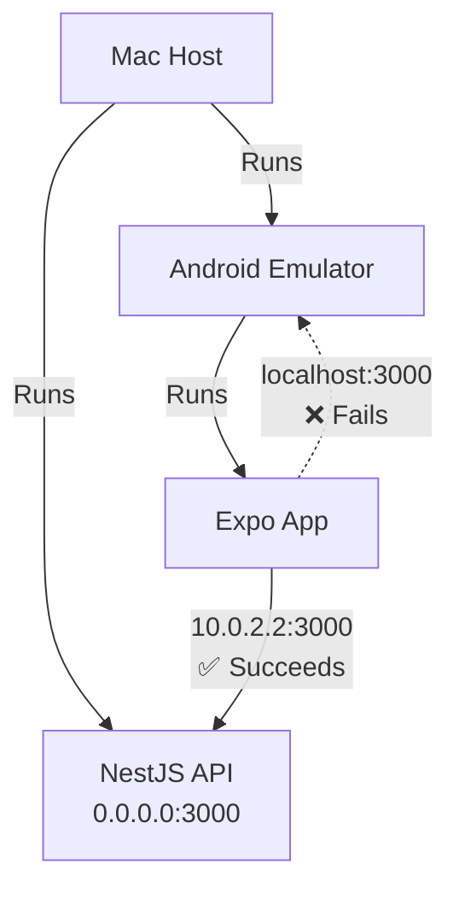

# Local Mobile Networking

When testing this project locally with an Android Emulator or physical device, it's critical to understand how the network is routed.

## The Architecture
Because the NestJS backend and the Expo frontend are running on your Mac (the host), `localhost` refers to the Mac when queried from the Mac.

However, the Android Emulator runs inside its own virtualized environment. Inside the emulator, `localhost` refers to the emulator itself, **not** the Mac. 

If the Expo app attempts to connect to `http://localhost:3000` from the Android emulator, it will time out or connect to nothing, resulting in severe performance hangs (like the 2-minute registration bug) or immediate connection refused errors.

## The Solution
To fix this, the frontend codebase explicitly uses the `Platform.OS` detection and environment variables to route API traffic:

1. **Environment Override:** You can set `EXPO_PUBLIC_API_URL` to point to any custom IP address (useful for physical devices over LAN, e.g., `192.168.1.x:3000`).
2. **Android Fallback:** If on Android and no explicit environment variable is set, it defaults to `http://10.0.2.2:3000/api/v1` which routes back to the host machine.
3. **iOS/Web Fallback:** Defaults to `http://localhost:3000/api/v1`.

## Timeouts
The global Axios instances now include a strict 10-second timeout. If the emulator is misconfigured or the backend goes down, the network request will cleanly fail after 10 seconds rather than hanging indefinitely on the OS-level TCP SYN timeout (which is up to 120s).
